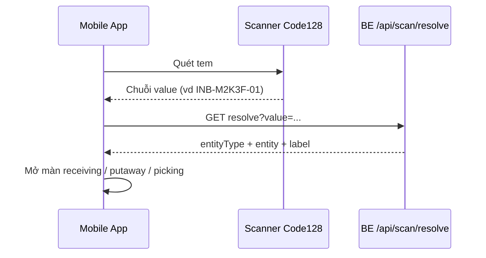

# Barcode Code128 — Mobile Warehouse Staff

> **Đối tượng**: App mobile `WH_STAFF` / `WH_TRANSPORTER` — quét inbound, outbound, LPN, SKU, bin.  
> **Symbology**: **Code 128** (subset B — ký tự ASCII in được, khuyến nghị không dùng ký tự điều khiển).

---

## 1. In tem / hiển thị mã

Mobile (hoặc máy in tem) **tự render** Code128 từ chuỗi `value` — BE không trả ảnh barcode.

| Loại | Chuỗi in trên tem (`value`) | Ví dụ |
|------|-----------------------------|--------|
| Inbound request | `inboundCode` | `INB-M2K3F-01` |
| Outbound request | `outboundCode` | `OUT-M2K3G-02` |
| LPN | `lpnCode` | `INB-M2K3F-01-LPN-001` |
| Batch | `batchCode` | `BATCH-001` |
| Bin | `binCode` | `B-A01-L1-01` |
| SKU | `skuCode` | `SKU-TSHIRT-RED-M` |

**Tùy chọn** (tránh nhầm loại thực thể): `NGW1|INBOUND|INB-…`, `NGW1|LPN|INB-…-LPN-001`, `NGW1|SKU|SKU-…`, `NGW1|BIN|B-A01-L1-01`.

---

## 2. Luồng mobile



1. User đăng nhập `WH_STAFF` (JWT có `warehouseId`).
2. Quét → nhận chuỗi (scanner mode **Code128**, không bắt buộc QR).
3. Gọi API resolve (mục 3).
4. Dùng `entityType` + `entity` để điều hướng UI (nhận hàng, putaway, pick…).

---

## 3. API

### Resolve sau quét

```http
GET /api/scan/resolve?value=INB-M2K3F-01
Authorization: Bearer <token>
```

Hoặc:

```http
POST /api/scan/resolve
{ "value": "INB-M2K3F-01" }
```

**Roles**: `WH_ADMIN`, `WH_STAFF`, `WH_TRANSPORTER`, `SYSTEM_ADMIN`.

**Response** (rút gọn — inbound):

```json
{
  "symbology": "CODE128",
  "value": "INB-M2K3F-01",
  "entityType": "INBOUND_REQUEST",
  "entity": { "...": "inbound request object" }
}
```

**Quét batch** (`BATCH-*` hoặc `NGW1|BATCH|…`) — **một request đủ** (batch không có `status`; tiến độ xem `lpns[].status` + `inbound.status`):

```json
{
  "entityType": "BATCH",
  "displayCode": "BATCH-2026-0001",
  "entity": {
    "batchId": "uuid",
    "batchCode": "BATCH-2026-0001",
    "inboundRequestId": "uuid",
    "warehouseReceivedAt": "2026-06-03T10:00:00.000Z",
    "inbound": {
      "inboundCode": "INB-M2K3F-01",
      "status": "RECEIVING"
    },
    "lpnCount": 2,
    "lpns": [
      {
        "lpnId": "uuid",
        "lpnCode": "INB-M2K3F-01-LPN-001",
        "status": "RECEIVING",
        "boxType": "MEDIUM",
        "actualQuantity": 120
      }
    ]
  }
}
```

Mobile: hiển thị danh sách `lpns` → user quét từng `lpnCode` → `GET /api/lpns/{lpnId}/details` (bước sau).

### Nhận diện tự động (`scanFormat: BUSINESS_CODE`)

| Prefix / pattern | `entityType` |
|------------------|--------------|
| `INB-` | `INBOUND_REQUEST` |
| `OUT-` | `OUTBOUND_REQUEST` |
| `BATCH-` | `BATCH` |
| Khác | Thử `LPN` → `BIN` → `SKU` trong **một kho** (`warehouseId` từ user) |

### Có cấu trúc (`scanFormat: NGW1`)

`NGW1|<ALIAS>|<payload>` — alias: `INBOUND`, `OUTBOUND`, `LPN`, `SKU`, `BIN`, `BATCH`.

---

## 4. Gợi ý thư viện mobile

| Nền tảng | Quét | In Code128 |
|----------|------|------------|
| React Native | `react-native-vision-camera` + frame processor, `react-native-barcode-mask` | `react-native-barcode-builder`, SVG từ `jsbarcode` |
| Flutter | `mobile_scanner` (Code128) | `barcode_widget` |
| WebView hybrid | ZXing / QuaggaJS (Code128) | JsBarcode |

Cấu hình scanner: bật **Code 128**; có thể tắt QR nếu chỉ dùng tem kho.

---

## 5. Liên kết nghiệp vụ WH Staff

| Màn hình (kế hoạch) | Quét |
|---------------------|------|
| Nhận hàng / receiving | `INB-*` hoặc **`BATCH-*` (ưu tiên — resolve kèm `lpns[]`)** |
| Tạo / gán LPN | Quét `INB-*` rồi in tem `lpnCode` |
| Put-away | Quét `LPN` + quét `BIN` |
| Picking outbound | Quét `OUT-*` hoặc `LPN` / `SKU` |

Chi tiết API role: `docs/staff_function.md`.

---

## 6. File BE liên quan

- `src/constants/barcode.js`
- `src/utils/barcodePayload.js`
- `src/services/scanResolve.service.js`
- `src/routes/scan.routes.js`
