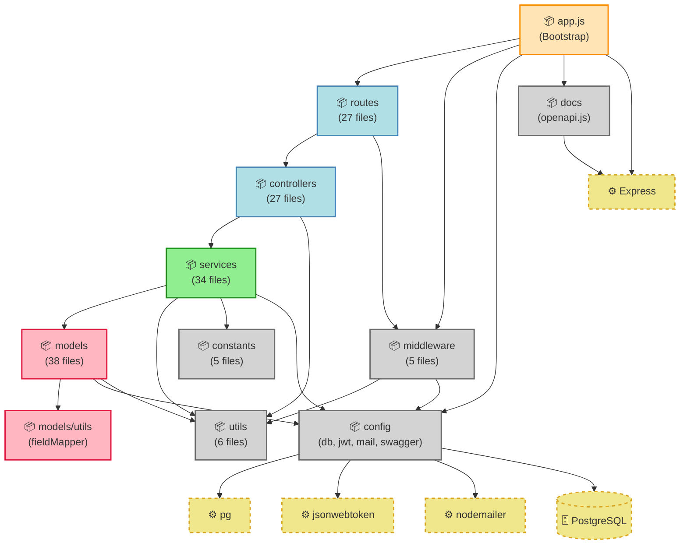
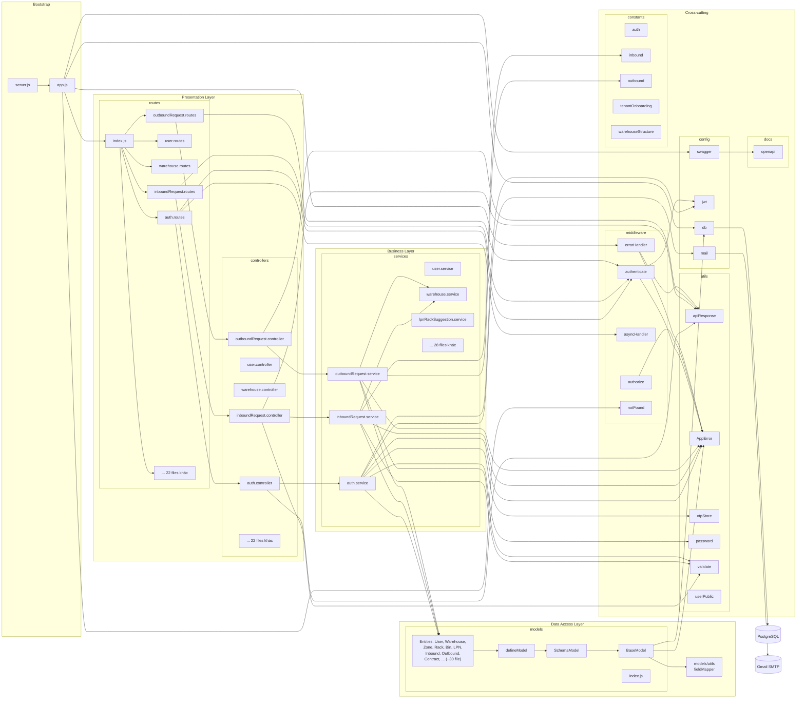
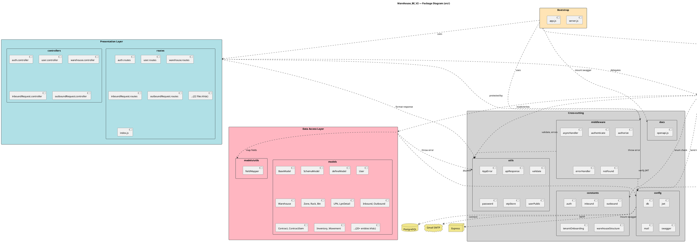
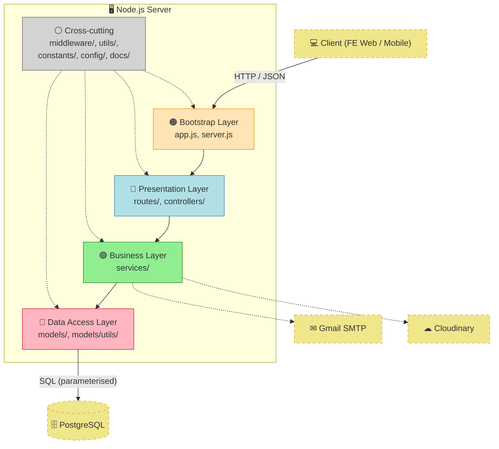

# Package Diagram — Warehouse_BE_V2 (`src/`)

> Tài liệu mô tả cấu trúc gói (package) của backend, dùng cho **báo cáo Capstone** và **on-board developer mới**.
> Cập nhật: 2026-05-29.

## Mục lục

- [1. Tổng quan cấu trúc thư mục](#1-tổng-quan-cấu-trúc-thư-mục)
- [2. Package Diagram — Mermaid (cấp cao)](#2-package-diagram--mermaid-cấp-cao)
- [3. Package Diagram — Mermaid (chi tiết với sub-package)](#3-package-diagram--mermaid-chi-tiết-với-sub-package)
- [4. Package Diagram — PlantUML chuẩn UML](#4-package-diagram--plantuml-chuẩn-uml)
- [5. Package Diagram — ASCII (paste vào Word)](#5-package-diagram--ascii-paste-vào-word)
- [6. Quy tắc phụ thuộc (Dependency rules)](#6-quy-tắc-phụ-thuộc-dependency-rules)
- [7. Bảng mô tả từng package](#7-bảng-mô-tả-từng-package)
- [8. Layered View (kèm Mermaid)](#8-layered-view-kèm-mermaid)

---

## 1. Tổng quan cấu trúc thư mục

Backend tổ chức theo mô hình **layered architecture** với 9 package chính dưới `src/`:

```
src/
├── app.js                        ← Bootstrap Express app
├── config/        (4 files)      ← Cấu hình hạ tầng
├── constants/     (5 files)      ← Enum & magic value
├── docs/          (1 file)       ← OpenAPI spec
├── middleware/    (5 files)      ← HTTP middleware
├── models/        (38 files)     ← Data access layer
│   └── utils/    (1 file)        ← Field mapper camel↔snake
├── routes/        (27 files)     ← HTTP routing
├── services/      (34 files)     ← Business logic
├── controllers/   (27 files)     ← HTTP handler
└── utils/         (6 files)      ← Cross-cutting helper
```

**Tổng**: ~150 file, ~3 lớp logic chính.

---

## 2. Package Diagram — Mermaid (cấp cao)

> Paste block dưới vào file `.md` trên GitHub / GitLab / Notion để render tự động.



### Chú thích màu

- 🟠 **Cam** — Bootstrap (entry point).
- 🔵 **Xanh dương** — Presentation Layer.
- 🟢 **Xanh lá** — Business Layer.
- 🩷 **Hồng** — Data Access Layer.
- ⚪ **Xám** — Cross-cutting concern.
- 🟡 **Vàng đứt nét** — External library / database.

---

## 3. Package Diagram — Mermaid (chi tiết với sub-package)

> Có chia rõ domain bên trong controllers/services/models cho báo cáo dài.



> Lưu ý: diagram chi tiết này nên dùng cho slide / báo cáo dài. Cho slide ngắn dùng diagram cấp cao ở mục 2.

---

## 4. Package Diagram — PlantUML chuẩn UML

> Render bằng `plantuml.com/plantuml/uml/` hoặc plugin IDE (PlantUML Integration). Đây là notation chuẩn UML 2.5 cho package diagram.



### Cách render

1. **Online**: copy code, paste vào https://www.plantuml.com/plantuml/uml/.
2. **VS Code**: cài extension *PlantUML* + Java + Graphviz, mở file `.puml` → Alt+D.
3. **IntelliJ**: cài plugin *PlantUML Integration*.
4. **Export**: PNG / SVG / PDF cho báo cáo.

---

## 5. Package Diagram — ASCII (paste vào Word)

> Cho báo cáo Word / Google Docs không render Mermaid được. Dùng font **Consolas** / **Courier New** để giữ alignment.

```
╔═══════════════════════════════════════════════════════════════════════════╗
║                   WAREHOUSE_BE_V2 — PACKAGE DIAGRAM                        ║
║                                                                            ║
║   ┌─────────────────────────────────────────────────────────────────────┐ ║
║   │                          BOOTSTRAP                                   │ ║
║   │   ┌──────────────┐    ┌──────────────┐                              │ ║
║   │   │  server.js   │───▶│   app.js     │                              │ ║
║   │   └──────────────┘    └──────┬───────┘                              │ ║
║   └─────────────────────────────┬┼─────────────────────────────────────┘ ║
║                                 ││                                        ║
║                                 ▼▼                                        ║
║   ┌─────────────────────────────────────────────────────────────────────┐ ║
║   │                    PRESENTATION LAYER                                │ ║
║   │   ┌────────────────────────────────────────────────────────────────┐│ ║
║   │   │  routes  (27 files)                                            ││ ║
║   │   │  ├─ index.js (mount all)                                       ││ ║
║   │   │  ├─ auth.routes        ├─ user.routes                          ││ ║
║   │   │  ├─ warehouse.routes   ├─ zone.routes                          ││ ║
║   │   │  ├─ rack.routes        ├─ rackLevel.routes                     ││ ║
║   │   │  ├─ bin.routes         ├─ rentalRequest.routes                 ││ ║
║   │   │  ├─ contract.routes    ├─ contractItem.routes                  ││ ║
║   │   │  ├─ tenantCompany.routes                                       ││ ║
║   │   │  ├─ storageReservation.routes                                  ││ ║
║   │   │  ├─ category.routes    ├─ season.routes                        ││ ║
║   │   │  ├─ collection.routes  ├─ sku.routes                           ││ ║
║   │   │  ├─ batch.routes       ├─ lpn.routes                           ││ ║
║   │   │  ├─ lpnDetail.routes   ├─ inboundRequest.routes                ││ ║
║   │   │  └─ outboundRequest.routes                                     ││ ║
║   │   └────────────────────────┬───────────────────────────────────────┘│ ║
║   │                            │                                        │ ║
║   │   ┌────────────────────────▼───────────────────────────────────────┐│ ║
║   │   │  controllers (27 files) — Parse req, format response only      ││ ║
║   │   └────────────────────────┬───────────────────────────────────────┘│ ║
║   └────────────────────────────┼─────────────────────────────────────────┘ ║
║                                │                                          ║
║                                ▼                                          ║
║   ┌─────────────────────────────────────────────────────────────────────┐ ║
║   │                    BUSINESS LAYER                                    │ ║
║   │   ┌────────────────────────────────────────────────────────────────┐│ ║
║   │   │  services  (34 files) — Validation + business rules            ││ ║
║   │   │  ├─ auth.service          ├─ user.service                      ││ ║
║   │   │  ├─ warehouse.service     ├─ warehouseZone.service              ││ ║
║   │   │  ├─ rack.service          ├─ rackLevel.service                  ││ ║
║   │   │  ├─ bin.service           ├─ rentalRequest.service              ││ ║
║   │   │  ├─ tenantCompany.service ├─ contract.service                   ││ ║
║   │   │  ├─ contractItem.service  ├─ storageReservation.service         ││ ║
║   │   │  ├─ category.service      ├─ season.service                     ││ ║
║   │   │  ├─ collection.service    ├─ sku.service                        ││ ║
║   │   │  ├─ batch.service         ├─ lpn.service                        ││ ║
║   │   │  ├─ lpnDetail.service     ├─ lpnRackSuggestion.service          ││ ║
║   │   │  ├─ inboundRequest.service                                      ││ ║
║   │   │  └─ outboundRequest.service                                     ││ ║
║   │   └────────────────────────┬───────────────────────────────────────┘│ ║
║   └────────────────────────────┼─────────────────────────────────────────┘ ║
║                                │                                          ║
║                                ▼                                          ║
║   ┌─────────────────────────────────────────────────────────────────────┐ ║
║   │                    DATA ACCESS LAYER                                 │ ║
║   │   ┌────────────────────────────────────────────────────────────────┐│ ║
║   │   │  models  (38 files) — CRUD wrapper trên pg                     ││ ║
║   │   │                                                                ││ ║
║   │   │   BaseModel ◀── SchemaModel ◀── defineModel ◀─ index.js       ││ ║
║   │   │      │                                                         ││ ║
║   │   │      └──▶ models/utils/fieldMapper.js                          ││ ║
║   │   │                                                                ││ ║
║   │   │   Entities (~30 files):                                        ││ ║
║   │   │     User, TenantCompany, Warehouse, WarehouseZone,             ││ ║
║   │   │     Rack, RackLevel, Bin,                                      ││ ║
║   │   │     RentalRequest, Contract, ContractItem,                     ││ ║
║   │   │     StorageReservation,                                        ││ ║
║   │   │     Category, Season, Collection, Sku, Batch,                  ││ ║
║   │   │     Lpn, LpnDetail,                                            ││ ║
║   │   │     Inventory, InventoryMovement,                              ││ ║
║   │   │     InboundRequest, InboundRequestItem,                        ││ ║
║   │   │     OutboundRequest, OutboundRequestItem,                      ││ ║
║   │   │     PickingTask, PickingTaskItem, Shipment,                    ││ ║
║   │   │     PricingPolicy, Invoice, InvoiceItem, Payment,              ││ ║
║   │   │     StorageUsageSnapshot, OccupancySnapshot,                   ││ ║
║   │   │     AiSlotRecommendation, SkuMovementAnalytics                 ││ ║
║   │   └────────────────────────┬───────────────────────────────────────┘│ ║
║   └────────────────────────────┼─────────────────────────────────────────┘ ║
║                                │                                          ║
║                                ▼                                          ║
║                       ┌────────────────┐                                  ║
║                       │  PostgreSQL    │                                  ║
║                       │ smart_warehouse│                                  ║
║                       └────────────────┘                                  ║
║                                                                            ║
║   ┌─────────────────────────────────────────────────────────────────────┐ ║
║   │                       CROSS-CUTTING                                  │ ║
║   │                                                                      │ ║
║   │  ┌─────────────────┐  ┌─────────────────┐  ┌────────────────────┐  │ ║
║   │  │  middleware (5) │  │   utils (6)     │  │  constants (5)     │  │ ║
║   │  │  authenticate   │  │  AppError       │  │  auth              │  │ ║
║   │  │  authorize      │  │  apiResponse    │  │  inbound           │  │ ║
║   │  │  asyncHandler   │  │  validate       │  │  outbound          │  │ ║
║   │  │  errorHandler   │  │  password       │  │  tenantOnboarding  │  │ ║
║   │  │  notFound       │  │  otpStore       │  │  warehouseStructure│  │ ║
║   │  │                 │  │  userPublic     │  │                    │  │ ║
║   │  └─────────────────┘  └─────────────────┘  └────────────────────┘  │ ║
║   │                                                                      │ ║
║   │  ┌──────────────────────┐                ┌────────────────────────┐ │ ║
║   │  │     config (4)       │                │     docs (1)           │ │ ║
║   │  │   db    │  jwt       │                │   openapi.js (50+ paths)│ │ ║
║   │  │   mail  │  swagger   │                │                        │ │ ║
║   │  └──────────────────────┘                └────────────────────────┘ │ ║
║   └──────────────────────────────────────────────────────────────────────┘ ║
╚═══════════════════════════════════════════════════════════════════════════╝
```

---

## 6. Quy tắc phụ thuộc (Dependency rules)

> Bảng này là **rule cứng** — vi phạm dẫn tới circular import hoặc khó test.

### 6.1 Ma trận phụ thuộc

✅ = được phép import / phụ thuộc.
❌ = KHÔNG được phép.

| Từ ↓ \ Đến → | bootstrap | routes | controllers | services | models | middleware | utils | constants | config | docs |
|---|---|---|---|---|---|---|---|---|---|---|
| **bootstrap** | – | ✅ | ❌ | ❌ | ❌ | ✅ | ❌ | ❌ | ✅ | ✅ |
| **routes** | ❌ | ✅ | ✅ | ❌ | ❌ | ✅ | ❌ | ❌ | ❌ | ❌ |
| **controllers** | ❌ | ❌ | ❌ | ✅ | ❌ | ❌ | ✅ | ❌ | ❌ | ❌ |
| **services** | ❌ | ❌ | ❌ | ✅ | ✅ | ❌ | ✅ | ✅ | ✅ | ❌ |
| **models** | ❌ | ❌ | ❌ | ❌ | ✅ | ❌ | ✅ | ❌ | ✅ | ❌ |
| **middleware** | ❌ | ❌ | ❌ | ❌ | ❌ | ✅ | ✅ | ❌ | ✅ | ❌ |
| **utils** | ❌ | ❌ | ❌ | ❌ | ❌ | ❌ | ✅ | ❌ | ❌ | ❌ |
| **constants** | ❌ | ❌ | ❌ | ❌ | ❌ | ❌ | ❌ | ❌ | ❌ | ❌ |
| **config** | ❌ | ❌ | ❌ | ❌ | ❌ | ❌ | ✅ | ❌ | ✅ | ❌ |
| **docs** | ❌ | ❌ | ❌ | ❌ | ❌ | ❌ | ❌ | ❌ | ❌ | ✅ |

### 6.2 Diễn giải

- **bootstrap** → routes, config, middleware, docs (entry point setup).
- **routes** → controllers + middleware. Không gọi service trực tiếp.
- **controllers** → services + utils (apiResponse, validate). Không truy cập DB.
- **services** → models + utils + constants + (config khi cần send mail / JWT). Cross-service call OK.
- **models** → models khác (ít) + config/db + utils. Không gọi service/controller/route.
- **middleware** → utils + config. Không phụ thuộc tầng business.
- **utils** → chỉ external + utils khác. Là nền tảng nhất.
- **constants** → 100% pure, không import gì.
- **config** → external lib + utils (rất hạn chế).

### 6.3 Vi phạm thường gặp & cách fix

| Vi phạm | Triệu chứng | Cách fix |
|---------|-------------|---------|
| Controller import model trực tiếp | DB query lộn xộn, khó refactor | Bọc qua service |
| Service A import Service B + Service B import Service A | Circular import, undefined exports | Tách helper riêng vào utils |
| Model gọi service | Vô lý — logic ngược chiều | Move logic về service |
| Route gọi DB | Bypass tầng business | Refactor qua controller → service |
| Utils import service/controller | Phá nguyên tắc utility độc lập | Move tới service |

---

## 7. Bảng mô tả từng package

| Package | File count | Trách nhiệm | Ví dụ file |
|---------|-----------|-------------|-----------|
| `bootstrap` (root + app.js) | 2 | Khởi tạo Express, mount middleware + routes, listen port | `server.js`, `app.js` |
| `config` | 4 | Cấu hình hạ tầng: DB pool, JWT signer, mail transporter, Swagger UI | `db.js`, `jwt.js`, `mail.js`, `swagger.js` |
| `constants` | 5 | Enum, magic value dùng chung, FREEZE để bất biến | `auth.js`, `inbound.js`, `outbound.js`, `tenantOnboarding.js`, `warehouseStructure.js` |
| `docs` | 1 | OpenAPI 3.0 spec single-file cho Swagger UI | `openapi.js` (~3000 dòng, 50+ paths) |
| `middleware` | 5 | Express middleware: auth, async wrap, error handler, 404 | `authenticate.js`, `authorize.js`, `asyncHandler.js`, `errorHandler.js`, `notFound.js` |
| `models` | 38 | Data access — wrapper trên pg, schema definition, CRUD generic | `BaseModel.js`, `SchemaModel.js`, `defineModel.js`, `User.js`, `OutboundRequest.js`,... |
| `models/utils` | 1 | Field mapper camelCase ↔ snake_case | `fieldMapper.js` |
| `routes` | 27 | HTTP routing: method + path + middleware + controller | `auth.routes.js`, `outboundRequest.routes.js`, `index.js` (mount all) |
| `controllers` | 27 | Parse req, gọi service, format response. Không có business logic | `auth.controller.js`, `outboundRequest.controller.js` |
| `services` | 34 | Business logic, validate, normalize, orchestration | `auth.service.js`, `outboundRequest.service.js`, `lpnRackSuggestion.service.js` |
| `utils` | 6 | Cross-cutting helper: error class, response format, validate, OTP, password | `AppError.js`, `apiResponse.js`, `validate.js`, `password.js`, `otpStore.js`, `userPublic.js` |

### Phân bổ độ phức tạp

```
Tổng: ~150 file
├─ services        ~22% (logic phức tạp nhất)
├─ models          ~25%
├─ routes          ~18%
├─ controllers     ~18%
├─ docs (openapi)   ~1% nhưng dòng code lớn (~3000)
├─ middleware       ~3%
├─ utils            ~4%
├─ constants        ~3%
├─ config           ~3%
└─ bootstrap        ~1%
```

---

## 8. Layered View (kèm Mermaid)

> View kiến trúc nhìn theo **tầng** — phù hợp slide thuyết trình.



### Mô tả

- **Bootstrap** — entry point, khởi tạo Express, mount router + middleware, listen port 3000.
- **Presentation Layer** — nhận HTTP, parse JSON, route theo URL, gọi controller. Controller parse `req`, delegate cho service, format `res`.
- **Business Layer** — chứa business rules. Validate input, check rule (vd contract phải ACTIVE), orchestrate nhiều model.
- **Data Access Layer** — wrapper CRUD trên `pg`, map camel ↔ snake, parameterised SQL.
- **Cross-cutting** — sử dụng xuyên các tầng. Không phụ thuộc tầng nào (trừ utils & config).

---

## 9. Hướng dẫn cập nhật

Khi thêm domain mới (ví dụ thêm `Shipment` API):

1. **Thêm model**: `src/models/Shipment.js`.
2. **Thêm constant** (nếu có enum): `src/constants/shipment.js`.
3. **Thêm service**: `src/services/shipment.service.js`.
4. **Thêm controller**: `src/controllers/shipment.controller.js`.
5. **Thêm route**: `src/routes/shipment.routes.js`.
6. **Mount route** vào `src/routes/index.js`.
7. **Cập nhật OpenAPI**: `src/docs/openapi.js`.
8. **Cập nhật file này**: bump số `services 34 → 35`, `controllers 27 → 28`,...

> Khi thêm cross-domain dependency (vd service A gọi service B), kiểm tra ma trận §6.1 để đảm bảo không vi phạm dependency rule.

---

## 10. Phụ lục — file cụ thể của từng domain

Mỗi domain có 4 file song hành. Đây là bảng tham chiếu nhanh:

| Domain | Model | Service | Controller | Route |
|--------|-------|---------|-----------|-------|
| Auth | (User) | `auth.service.js` | `auth.controller.js` | `auth.routes.js` |
| User | `User.js` | `user.service.js` | `user.controller.js` | `user.routes.js` |
| Warehouse | `Warehouse.js` | `warehouse.service.js` | `warehouse.controller.js` | `warehouse.routes.js` |
| Zone | `WarehouseZone.js` | `warehouseZone.service.js` | `warehouseZone.controller.js` | `zone.routes.js` |
| Rack | `Rack.js` | `rack.service.js` | `rack.controller.js` | `rack.routes.js` |
| RackLevel | `RackLevel.js` | `rackLevel.service.js` | `rackLevel.controller.js` | `rackLevel.routes.js` |
| Bin | `Bin.js` | `bin.service.js` | `bin.controller.js` | `bin.routes.js` |
| RentalRequest | `RentalRequest.js` | `rentalRequest.service.js` | `rentalRequest.controller.js` | `rentalRequest.routes.js` |
| TenantCompany | `TenantCompany.js` | `tenantCompany.service.js` | `tenantCompany.controller.js` | `tenantCompany.routes.js` |
| Contract | `Contract.js` | `contract.service.js` | `contract.controller.js` | `contract.routes.js` |
| ContractItem | `ContractItem.js` | `contractItem.service.js` | `contractItem.controller.js` | `contractItem.routes.js` |
| StorageReservation | `StorageReservation.js` | `storageReservation.service.js` | `storageReservation.controller.js` | `storageReservation.routes.js` |
| Category | `Category.js` | `category.service.js` | `category.controller.js` | `category.routes.js` |
| Season | `Season.js` | `season.service.js` | `season.controller.js` | `season.routes.js` |
| Collection | `Collection.js` | `collection.service.js` | `collection.controller.js` | `collection.routes.js` |
| SKU | `Sku.js` | `sku.service.js` | `sku.controller.js` | `sku.routes.js` |
| Batch | `Batch.js` | `batch.service.js` | `batch.controller.js` | `batch.routes.js` |
| LPN | `Lpn.js` | `lpn.service.js`, `lpnRackSuggestion.service.js` | `lpn.controller.js` | `lpn.routes.js` |
| LpnDetail | `LpnDetail.js` | `lpnDetail.service.js` | `lpnDetail.controller.js` | `lpnDetail.routes.js` |
| InboundRequest | `InboundRequest.js`, `InboundRequestItem.js` | `inboundRequest.service.js` | `inboundRequest.controller.js` | `inboundRequest.routes.js` |
| OutboundRequest | `OutboundRequest.js`, `OutboundRequestItem.js` | `outboundRequest.service.js` | `outboundRequest.controller.js` | `outboundRequest.routes.js` |

---

> Đây là tài liệu **package-level**. Để xem chi tiết class diagram cho từng entity, xem `docs/db4.md` và `docs/relationship.md`.

> Người duy trì: **BE Team Lead**. Cập nhật mỗi khi thêm domain mới.
