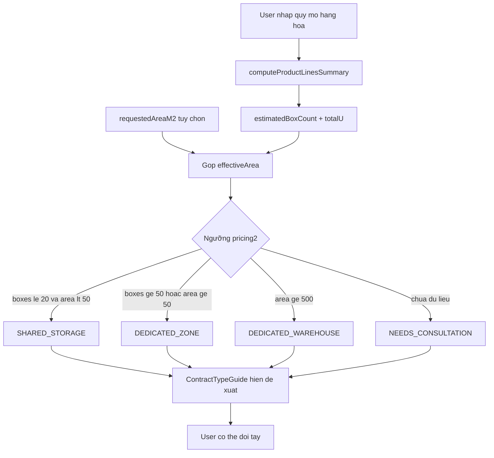

# Làm lại logic recommend loại hình thuê — Landing Page

## Hiện trạng

- Landing ([`Landing.tsx`](Warehouse_FE_Web/Warehouse_Web_FE/src/pages/public/Landing.tsx)) đặt [`ContractTypeGuide`](Warehouse_FE_Web/Warehouse_Web_FE/src/components/public/ContractTypeGuide.tsx) **trước** form; mặc định `NEEDS_CONSULTATION`, user chọn thủ công.
- Quy mô hàng hóa (`productLines`) nằm **sâu trong** [`RentalRequestForm.tsx`](Warehouse_FE_Web/Warehouse_Web_FE/src/components/public/RentalRequestForm.tsx) (sau ngày thuê).
- FE đã có công thức U/thùng: [`computeProductLinesSummary`](Warehouse_FE_Web/Warehouse_Web_FE/src/utils/volumeUnits.ts) + [`allocateBoxes`](Warehouse_FE_Web/Warehouse_Web_FE/src/utils/volumeUnits.ts) — đồng bộ BE.
- WH admin dùng [`suggestBillableContractType`](Warehouse_FE_Web/Warehouse_Web_FE/src/data/contractTypes.ts) (chỉ `areaM2 > 0 → DEDICATED_ZONE`, còn lại `SHARED_STORAGE`) — **chưa dùng volume/box count**.
- Ngưỡng nghiệp vụ đã có trong [`pricing2.md`](Warehouse_BE_V2/docs/pricing2.md):

| Quy mô                        | Loại hình             |
| ----------------------------- | --------------------- |
| ~10–20 thùng, linh hoạt       | `SHARED_STORAGE`      |
| ≥ ~50 thùng hoặc ~50 m² riêng | `DEDICATED_ZONE`      |
| ≥ ~500 m² (nguyên kho)        | `DEDICATED_WAREHOUSE` |
| Chưa nhập đủ dữ liệu          | `NEEDS_CONSULTATION`  |

`RESERVED_STORAGE` **không** gợi ý cho guest (WH chọn khi duyệt).



---

## Thay đổi chính

### 1. Tạo engine gợi ý (FE, shared)

**File mới:** [`src/utils/contractTypeRecommendation.ts`](Warehouse_FE_Web/Warehouse_Web_FE/src/utils/contractTypeRecommendation.ts)

Export:

- `CONTRACT_RECOMMENDATION_THRESHOLDS` — đồng bộ `pricing2.md` + `REFERENCE_ZONE_AREA_M2` (50) từ [`warehouseCapacity.ts`](Warehouse_FE_Web/Warehouse_Web_FE/src/utils/warehouseCapacity.ts)
- `recommendGuestContractType(input)` → `{ contractType, confidence, reason, metrics }`

**Input:**

```ts
{
  estimatedBoxCount?: number | null
  totalCommittedVolumeUnits?: number | null
  requestedAreaM2?: number | null
}
```

**Logic đề xuất:**

1. Không có `productLines` hợp lệ **và** không có `requestedAreaM2 > 0` → `NEEDS_CONSULTATION`, confidence `low`
2. `requestedAreaM2 >= 500` → `DEDICATED_WAREHOUSE`
3. `requestedAreaM2 >= 50` **hoặc** `estimatedBoxCount >= 50` → `DEDICATED_ZONE`
4. `estimatedBoxCount <= 20` (và area < 50) → `SHARED_STORAGE`
5. Vùng xám 21–49 thùng, chưa nhập m² → `SHARED_STORAGE`, confidence `medium`, lý do "quy mô trung bình — kho có thể tư vấn thêm khi duyệt"

**Cập nhật** [`suggestBillableContractType`](Warehouse_FE_Web/Warehouse_Web_FE/src/data/contractTypes.ts) để WH admin onboarding dùng cùng engine (truyền thêm `estimatedBoxCount` từ rental request) — tránh logic lệch giữa guest và WH.

### 2. Đổi bố cục form — quy mô trước, gợi ý sau

**[`RentalRequestForm.tsx`](Warehouse_FE_Web/Warehouse_Web_FE/src/components/public/RentalRequestForm.tsx):**

- **Đưa block "Quy mô hàng hóa"** (`RentalProductLinesEditor`) lên **đầu** phần "Nhu cầu thuê kho" (ngay sau thông tin doanh nghiệp, trước khu vực/ngày thuê).
- **Bỏ `ContractTypeGuide` khỏi `Landing.tsx`**, render **bên trong form** ngay sau quy mô hàng hóa.
- Giữ dropdown "Loại hình thuê" nhưng đồng bộ với card đã chọn (hoặc thu gọn thành read-only khi đã có gợi ý — tùy chỗ trong layout).

**[`Landing.tsx`](Warehouse_FE_Web/Warehouse_Web_FE/src/pages/public/Landing.tsx):**

- Chỉ giữ state `contractType` + truyền xuống form; bỏ `<ContractTypeGuide />` ở top.

### 3. Auto-recommend + cho phép override

Trong `RentalRequestForm`:

- `useMemo` gọi `computeProductLinesSummary` khi `productLines` + catalog sẵn sàng.
- `useMemo` gọi `recommendGuestContractType` từ summary + `requestedAreaM2`.
- State `userOverrodeContractType: boolean` — khi user click card/dropdown khác gợi ý → set `true`, **không** auto-đổi nữa cho đến khi quy mô thay đổi đáng kể (reset flag khi `estimatedBoxCount` hoặc `requestedAreaM2` đổi).
- Khi chưa override: `onContractTypeChange(recommended.contractType)` tự động.

### 4. Cập nhật UI `ContractTypeGuide`

**[`ContractTypeGuide.tsx`](Warehouse_FE_Web/Warehouse_Web_FE/src/components/public/ContractTypeGuide.tsx):**

Props mới:

```ts
recommendation?: {
  contractType: ContractTypeValue
  confidence: 'high' | 'medium' | 'low'
  reason: string
  metrics?: { estimatedBoxCount?: number; totalU?: number; effectiveAreaM2?: number }
} | null
```

UI:

- Banner phía trên: _"Đề xuất: Lưu hàng linh hoạt — ~15 thùng/tháng, phù hợp kho chia sẻ"_
- Card được gợi ý: badge **"Đề xuất"** (khác badge "Đang chọn")
- Khi `NEEDS_CONSULTATION`: copy _"Nhập loại hàng + số lượng để hệ thống gợi ý"_
- Ẩn/de-emphasize `NEEDS_CONSULTATION` card khi đã có gợi ý rõ (`confidence: high`)

### 5. Đồng bộ preview kho theo gợi ý

[`guestRegionWarehouseCopy`](Warehouse_FE_Web/Warehouse_Web_FE/src/data/contractTypes.ts) và block preview kho trong form đã phụ thuộc `contractType` — sẽ tự cập nhật khi auto-select. Không cần API mới.

### 6. Tests

**File mới:** `src/utils/contractTypeRecommendation.test.ts`

Cases:

- 0 dữ liệu → `NEEDS_CONSULTATION`
- 15 thùng → `SHARED_STORAGE`
- 55 thùng → `DEDICATED_ZONE`
- 600 m² → `DEDICATED_WAREHOUSE`
- 30 thùng (vùng xám) → `SHARED_STORAGE`, medium
- `requestedAreaM2 = 80` dù ít thùng → `DEDICATED_ZONE`

---

## Phạm vi KHÔNG làm (giữ tối thiểu)

- Không thêm API BE preview recommend (tính client-side đủ, cùng công thức BE).
- Không gợi ý `RESERVED_STORAGE` trên landing.
- Checkbox fast-picking / premium chỉ ảnh hưởng `suggestedZoneType` (giữ nguyên [`deriveSuggestedZoneType`](Warehouse_FE_Web/Warehouse_Web_FE/src/utils/rentalRequestGuest.ts)).

---

## Files chạm

| File                                           | Thay đổi                              |
| ---------------------------------------------- | ------------------------------------- |
| `src/utils/contractTypeRecommendation.ts`      | **Mới** — engine gợi ý                |
| `src/utils/contractTypeRecommendation.test.ts` | **Mới** — unit tests                  |
| `src/data/contractTypes.ts`                    | Mở rộng `suggestBillableContractType` |
| `src/components/public/ContractTypeGuide.tsx`  | UI gợi ý + badge                      |
| `src/components/public/RentalRequestForm.tsx`  | Reorder + auto-recommend + override   |
| `src/pages/public/Landing.tsx`                 | Bỏ ContractTypeGuide ở top            |
