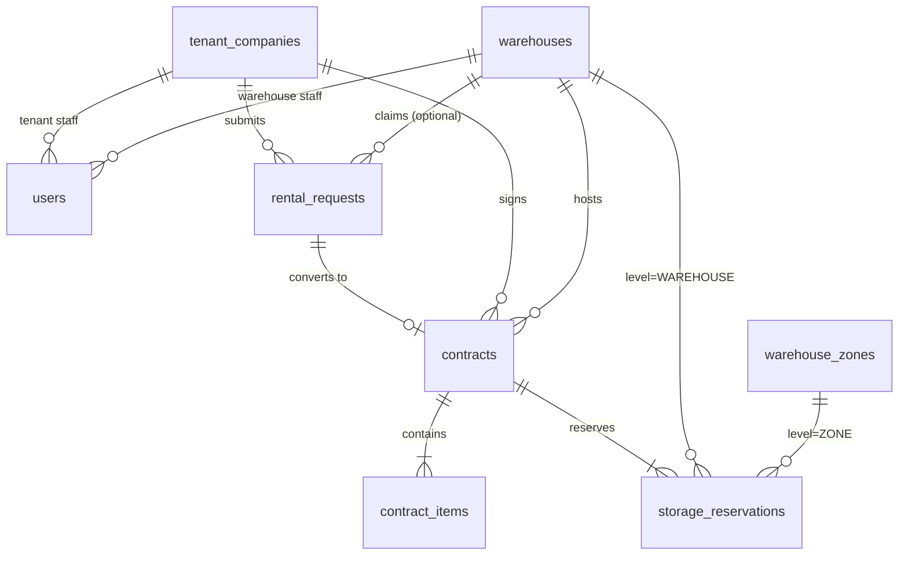
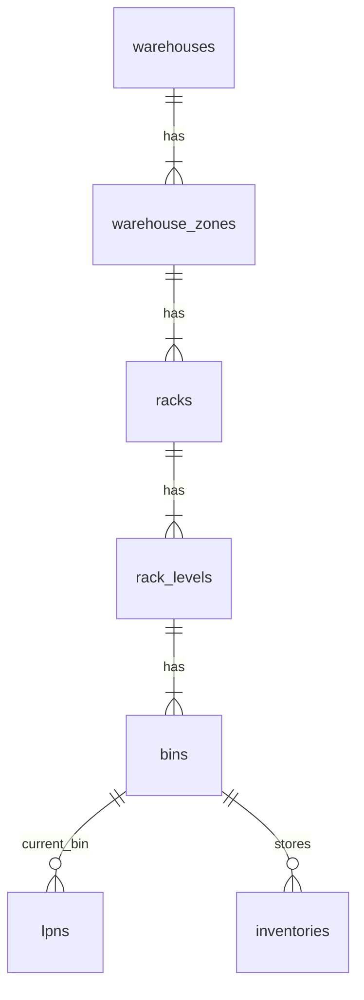
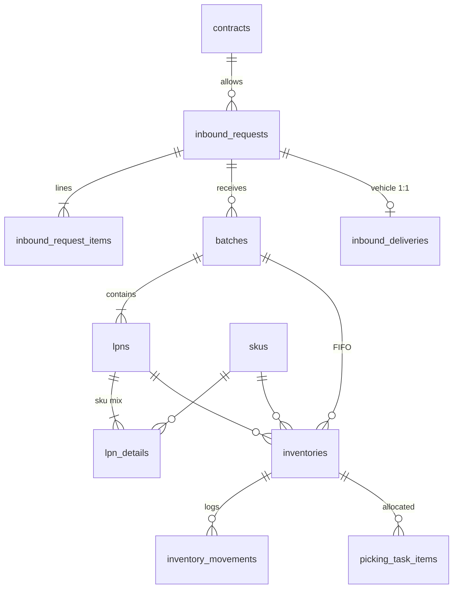
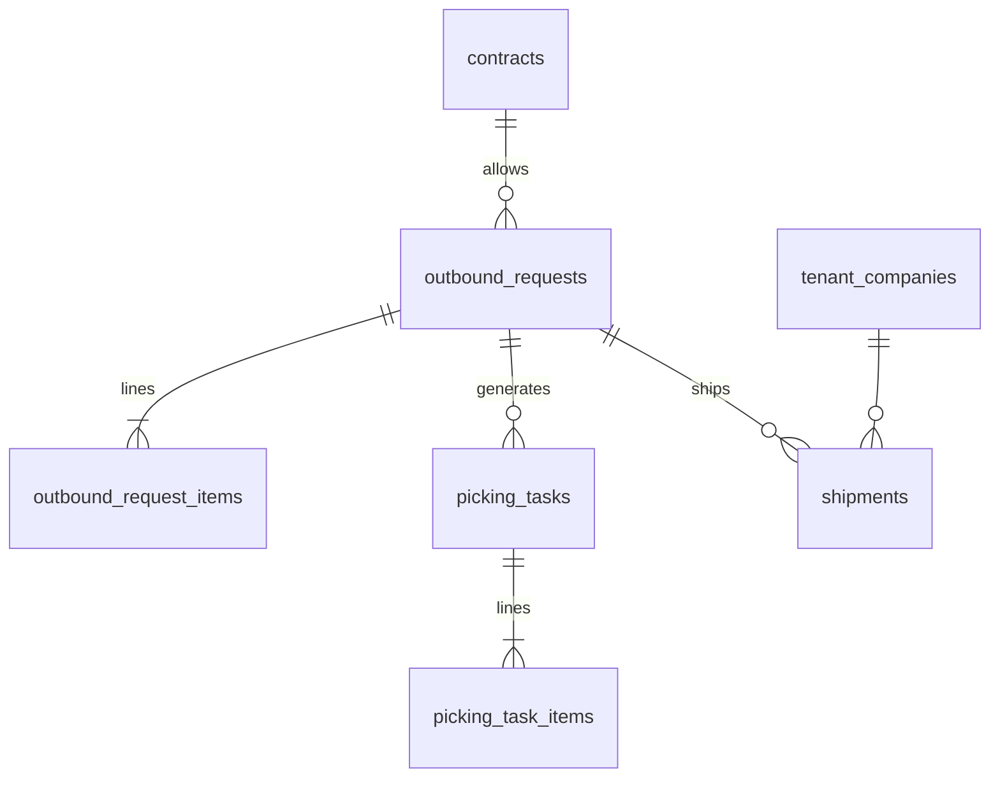
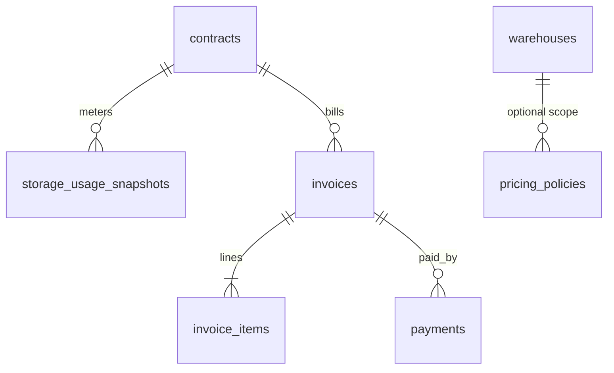
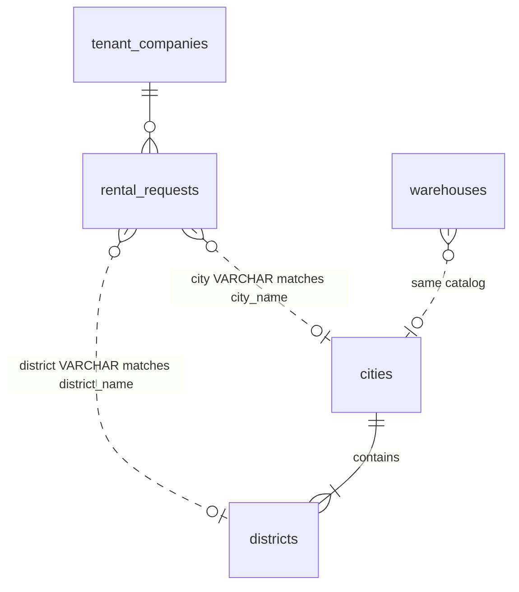

# Warehouse DB — Quan hệ bảng & đối chiếu Models ↔ db4.md

> **Mục đích:** Tài liệu để vẽ **Conceptual**, **Logical**, **Physical** diagram.  
> **Nguồn tham chiếu:** `docs/db4.md` (DBML thiết kế), `src/models/*.js` (application layer), `init-scripts/01-db4-schema.sql` (PostgreSQL thực tế).

---

## 1. Kết quả đối chiếu Models ↔ db4.md

### 1.1 Khớp (có model export + có trong db4.md) — **35 bảng**

| Bảng (physical) | Model file |
|-----------------|------------|
| `tenant_companies` | TenantCompany.js |
| `warehouses` | Warehouse.js |
| `users` | User.js |
| `warehouse_zones` | WarehouseZone.js |
| `racks` | Rack.js |
| `rack_levels` | RackLevel.js |
| `bins` | Bin.js |
| `rental_requests` | RentalRequest.js |
| `contracts` | Contract.js |
| `contract_items` | ContractItem.js |
| `storage_reservations` | StorageReservation.js |
| `categories` | Category.js |
| `collections` | Collection.js |
| `seasons` | Season.js |
| `skus` | Sku.js |
| `inbound_requests` | InboundRequest.js *(+ `delivery_mode`, §1.3)* |
| `inbound_request_items` | InboundRequestItem.js |
| `batches` | Batch.js |
| `lpns` | Lpn.js |
| `lpn_details` | LpnDetail.js |
| `inventories` | Inventory.js |
| `inventory_movements` | InventoryMovement.js |
| `outbound_requests` | OutboundRequest.js |
| `outbound_request_items` | OutboundRequestItem.js |
| `picking_tasks` | PickingTask.js |
| `picking_task_items` | PickingTaskItem.js |
| `shipments` | Shipment.js *(+ vehicle/driver, §1.3)* |
| `pricing_policies` | PricingPolicy.js |
| `storage_usage_snapshots` | StorageUsageSnapshot.js |
| `invoices` | Invoice.js |
| `invoice_items` | InvoiceItem.js |
| `payments` | Payment.js |
| `ai_slot_recommendations` | AiSlotRecommendation.js |
| `occupancy_snapshots` | OccupancySnapshot.js |
| `sku_movement_analytics` | SkuMovementAnalytics.js |

**Kết luận:** Phần lõi WMS (tenant → location → contract → SKU → inbound/LPN/inventory → outbound/picking → billing → analytics) **khớp tốt** giữa models và db4.md.

### 1.2 Có trong db4.md nhưng **chưa có Model**

| Bảng | Trạng thái | Ghi chú |
|------|------------|---------|
| `cities` | Chỉ raw SQL + `location.service.js` | Catalog tham chiếu; `rental_requests.city` lưu **VARCHAR** (không FK) |
| `districts` | Chỉ raw SQL + `location.service.js` | FK → `cities`; `rental_requests.district` lưu **VARCHAR** (không FK) |

### 1.3 Còn lệch giữa Model và db4.md / DB

| Bảng / Field | Model | db4.md | Ghi chú |
|--------------|-------|--------|---------|
| `cities`, `districts` | ✗ (raw SQL) | ✓ | Cần thêm model nếu muốn ORM đầy đủ |
| `inbound_deliveries` | ✓ file, chưa export `index.js` | ✓ | Export trong `index.js` khi dùng CRUD |
| `contract_type_enum.NEEDS_CONSULTATION` | string | ✓ | Model không khai báo enum tường minh |

### 1.4 Có Model nhưng **không thuộc db4 / init schema chính**

| Bảng | Model | Ghi chú |
|------|-------|---------|
| `branches` | Branch.js | Script riêng `scripts/sql/branches.sql`; quan hệ `manager_id` → `users` — **legacy / ngoài phạm vi db4** |

### 1.5 Khuyến nghị đồng bộ còn lại

1. ~~Cập nhật `docs/db4.md`~~ — đã sync với `01-db4-schema.sql` (2026-05-28).
2. Thêm model `City.js`, `District.js` (hoặc ghi rõ “reference-only, no ORM”).
3. Export `InboundDelivery` trong `src/models/index.js`.
4. Quyết định giữ hay bỏ `branches` khỏi diagram chính.

---

## 2. Phân vùng domain (Conceptual)

```
┌─────────────────────────────────────────────────────────────────────────┐
│ ORGANIZATION & AUTH                                                       │
│   TenantCompany ──< User                                                  │
│   Warehouse   ──< User (WH_ADMIN / WH_STAFF)                              │
│   City ──< District          (catalog; soft-link tới rental/warehouse)    │
├─────────────────────────────────────────────────────────────────────────┤
│ WAREHOUSE STRUCTURE (physical layout)                                     │
│   Warehouse ──< WarehouseZone ──< Rack ──< RackLevel ──< Bin            │
├─────────────────────────────────────────────────────────────────────────┤
│ COMMERCIAL / CAPACITY                                                     │
│   RentalRequest ──(0..1)──> Contract ──< ContractItem                     │
│                          └──< StorageReservation (polymorphic location) │
├─────────────────────────────────────────────────────────────────────────┤
│ PRODUCT MASTER (per tenant)                                               │
│   TenantCompany ──< Sku >── Category, Collection, Season                  │
├─────────────────────────────────────────────────────────────────────────┤
│ INBOUND → LPN → INVENTORY (FIFO grain)                                    │
│   InboundRequest ──< InboundRequestItem, Batch, InboundDelivery(1:1)      │
│   Batch ──< Lpn ──< LpnDetail >── Sku                                     │
│   Inventory = Sku + Batch + Lpn + Bin (+ status)                          │
├─────────────────────────────────────────────────────────────────────────┤
│ OUTBOUND → PICK → SHIP                                                    │
│   OutboundRequest ──< OutboundRequestItem, PickingTask ──< PickingTaskItem│
│   OutboundRequest ──< Shipment                                            │
├─────────────────────────────────────────────────────────────────────────┤
│ BILLING & ANALYTICS                                                       │
│   Contract ──< Invoice ──< InvoiceItem, Payment                           │
│   Contract ──< StorageUsageSnapshot                                       │
│   PricingPolicy (optional warehouse scope)                                │
│   AiSlotRecommendation, OccupancySnapshot, SkuMovementAnalytics           │
└─────────────────────────────────────────────────────────────────────────┘
```

---

## 3. Danh sách quan hệ FK (Logical / Physical)

Ký hiệu: `A ──< B` = B có FK tới A (many-to-one). `(1)` = one-to-one hoặc unique FK.

### 3.1 Organization & location catalog

| Child table | FK column(s) | Parent table | Cardinality | Nullable | On delete (PG) |
|-------------|--------------|--------------|-------------|----------|----------------|
| `districts` | `city_id` | `cities` | N:1 | NO | CASCADE |
| `users` | `tenant_id` | `tenant_companies` | N:1 | YES | — |
| `users` | `warehouse_id` | `warehouses` | N:1 | YES | — |

**Soft reference (không FK):**

| Table | Columns | Semantics |
|-------|---------|-----------|
| `rental_requests` | `city`, `district` | Label khớp `cities.city_name`, `districts.district_name` |
| `warehouses` | `city`, `district` | Cùng catalog, không FK |

### 3.2 Warehouse structure (composition hierarchy)

```
warehouses (1) ──< warehouse_zones (N)
warehouse_zones (1) ──< racks (N)
racks (1) ──< rack_levels (N)
rack_levels (1) ──< bins (N)
```

| Child | FK | Parent | Unique constraint |
|-------|-----|--------|-------------------|
| `warehouse_zones` | `warehouse_id` | `warehouses` | `(warehouse_id, zone_code)` |
| `racks` | `zone_id` | `warehouse_zones` | `(zone_id, rack_code)` |
| `rack_levels` | `rack_id` | `racks` | `(rack_id, level_number)` |
| `bins` | `rack_level_id` | `rack_levels` | `(rack_level_id, bin_code)` |

### 3.3 Rental & contract

| Child | FK | Parent | Cardinality | Notes |
|-------|-----|--------|-------------|-------|
| `rental_requests` | `tenant_id` | `tenant_companies` | N:1 | required |
| `rental_requests` | `warehouse_id` | `warehouses` | N:1 | nullable until claimed |
| `rental_requests` | `reviewed_by`, `created_by` | `users` | N:1 | nullable |
| `contracts` | `tenant_id` | `tenant_companies` | N:1 | required |
| `contracts` | `warehouse_id` | `warehouses` | N:1 | required |
| `contracts` | `rental_request_id` | `rental_requests` | (1):1 | UNIQUE on `rental_request_id` |
| `contracts` | `created_by`, `approved_by` | `users` | N:1 | nullable |
| `contract_items` | `contract_id` | `contracts` | N:1 | required |
| `storage_reservations` | `contract_id` | `contracts` | N:1 | required |
| `storage_reservations` | `tenant_id` | `tenant_companies` | N:1 | required |
| `storage_reservations` | `warehouse_id` | `warehouses` | N:1 | required |
| `storage_reservations` | `zone_id` | `warehouse_zones` | N:1 | nullable* |
| `storage_reservations` | `rack_id` | `racks` | N:1 | nullable* |
| `storage_reservations` | `rack_level_id` | `rack_levels` | N:1 | nullable* |
| `storage_reservations` | `bin_id` | `bins` | N:1 | nullable* |

\* **Business rule (polymorphic reservation):** `storage_level` quyết định cột location bắt buộc:

| `storage_level` | Required FK |
|-----------------|-------------|
| `WAREHOUSE` | `warehouse_id` |
| `ZONE` | `zone_id` |
| `RACK` | `rack_id` |
| `RACK_LEVEL` | `rack_level_id` |
| `BIN` | `bin_id` |

### 3.4 Product master

| Child | FK | Parent |
|-------|-----|--------|
| `collections` | `tenant_id` | `tenant_companies` |
| `skus` | `tenant_id` | `tenant_companies` |
| `skus` | `category_id` | `categories` |
| `skus` | `collection_id` | `collections` |
| `skus` | `season_id` | `seasons` |

Unique: `(tenant_id, sku_code)` on `skus`.

### 3.5 Inbound chain

| Child | FK | Parent | Cardinality |
|-------|-----|--------|-------------|
| `inbound_requests` | `tenant_id` | `tenant_companies` | N:1 |
| `inbound_requests` | `contract_id` | `contracts` | N:1 |
| `inbound_requests` | `warehouse_id` | `warehouses` | N:1 |
| `inbound_requests` | `created_by`, `approved_by`, `received_by` | `users` | N:1 |
| `inbound_deliveries` | `inbound_request_id` | `inbound_requests` | **(1):1** UNIQUE |
| `inbound_deliveries` | `tenant_id` | `tenant_companies` | N:1 |
| `inbound_request_items` | `inbound_request_id` | `inbound_requests` | N:1 |
| `inbound_request_items` | `sku_id` | `skus` | N:1 |
| `batches` | `inbound_request_id` | `inbound_requests` | N:1 |
| `lpns` | `tenant_id` | `tenant_companies` | N:1 |
| `lpns` | `batch_id` | `batches` | N:1 |
| `lpns` | `current_bin_id` | `bins` | N:1 (nullable) |
| `lpn_details` | `lpn_id` | `lpns` | N:1 |
| `lpn_details` | `sku_id` | `skus` | N:1 |

**Quy tắc nghiệp vụ:** 1 LPN = 1 tenant; LPN thuộc 1 batch; batch thuộc 1 inbound request.

### 3.6 Inventory (granularity = SKU + Batch + LPN + Bin + Status)

| Child | FK | Parent |
|-------|-----|--------|
| `inventories` | `tenant_id` | `tenant_companies` |
| `inventories` | `sku_id` | `skus` |
| `inventories` | `batch_id` | `batches` |
| `inventories` | `lpn_id` | `lpns` |
| `inventories` | `bin_id` | `bins` |
| `inventory_movements` | `inventory_id` | `inventories` |
| `inventory_movements` | `from_bin_id`, `to_bin_id` | `bins` |
| `inventory_movements` | `moved_by` | `users` |

Derived field: `available_quantity` ≈ `quantity - reserved_quantity`.

### 3.7 Outbound chain

| Child | FK | Parent |
|-------|-----|--------|
| `outbound_requests` | `tenant_id`, `contract_id`, `warehouse_id` | respective parents |
| `outbound_requests` | `created_by`, `approved_by` | `users` |
| `outbound_request_items` | `outbound_request_id` | `outbound_requests` |
| `outbound_request_items` | `sku_id` | `skus` |
| `picking_tasks` | `outbound_request_id` | `outbound_requests` |
| `picking_tasks` | `assigned_to` | `users` |
| `picking_task_items` | `picking_task_id` | `picking_tasks` |
| `picking_task_items` | `inventory_id` | `inventories` |
| `picking_task_items` | `lpn_id`, `bin_id`, `batch_id` | denormalized refs for pick path |
| `shipments` | `tenant_id` | `tenant_companies` |
| `shipments` | `outbound_request_id` | `outbound_requests` |

### 3.8 Billing

| Child | FK | Parent | Notes |
|-------|-----|--------|-------|
| `pricing_policies` | `warehouse_id` | `warehouses` | NULL = global price |
| `storage_usage_snapshots` | `tenant_id`, `contract_id` | parents | UNIQUE composite per day |
| `invoices` | `tenant_id`, `contract_id` | parents | |
| `invoice_items` | `invoice_id` | `invoices` | `reference_id` polymorphic (no FK) |
| `payments` | `invoice_id` | `invoices` | |

### 3.9 AI / Analytics

| Child | FK | Parent |
|-------|-----|--------|
| `ai_slot_recommendations` | `inbound_request_id` | `inbound_requests` |
| `ai_slot_recommendations` | `lpn_id`, `sku_id` | `lpns`, `skus` |
| `ai_slot_recommendations` | `recommended_zone_id`, `recommended_bin_id` | `warehouse_zones`, `bins` |
| `occupancy_snapshots` | `warehouse_id`, `zone_id` | `warehouses`, `warehouse_zones` |
| `sku_movement_analytics` | `sku_id` | `skus` | UNIQUE `(sku_id, snapshot_date)` |

---

## 4. Sơ đồ ER (Mermaid) — dùng cho Logical diagram

### 4.1 Core: Tenant → Warehouse → Contract



### 4.2 Location hierarchy



### 4.3 Inbound → Inventory



### 4.4 Outbound → Shipment



### 4.5 Billing



### 4.6 Location catalog (soft link)



> Đường `}o..o|` = **association không FK** (conceptual only).

---

## 5. Hướng dẫn vẽ 3 loại diagram

### 5.1 Conceptual diagram

- **Entities:** Tenant, Warehouse, Zone, Rack, Bin, Contract, SKU, Inbound, LPN, Inventory, Outbound, Invoice (gom nhóm, không cần mọi cột).
- **Quan hệ chính:**
  - Tenant **thuê** Warehouse (qua Contract).
  - Warehouse **chứa** Location hierarchy.
  - Tenant **sở hữu** SKU.
  - Inbound **tạo** Batch/LPN **cất** vào Bin → **tạo** Inventory.
  - Outbound **yêu cầu** pick từ Inventory → **giao** Shipment.
- **Bỏ qua:** PK UUID, index, enum chi tiết, snapshot tables (hoặc gom “Billing”, “Analytics”).
- **Ghi chú:** `City`/`District` là **lookup catalog**, link mềm tới RentalRequest.

### 5.2 Logical diagram

- Liệt kê **tất cả bảng** trong §3 + **cardinality** + **unique constraints**.
- Thể hiện **polymorphic** `storage_reservations` bằng note hoặc subtype (WAREHOUSE | ZONE | RACK | RACK_LEVEL | BIN).
- Thể hiện **1:1** `rental_requests` ↔ `contracts` (unique `rental_request_id`).
- Thể hiện **1:1** `inbound_requests` ↔ `inbound_deliveries`.
- `invoice_items.reference_id` = logical polymorphic (không FK).

### 5.3 Physical diagram (PostgreSQL)

- Dùng tên bảng/cột **snake_case** như `init-scripts/01-db4-schema.sql`.
- Ghi **ENUM types** (40+ enums, xem `db4.md` §ENUMS + `delivery_mode_enum`, `NEEDS_CONSULTATION`).
- Ghi **indexes** quan trọng: status columns, `(tenant_id, sku_code)`, snapshot uniques.
- **ON DELETE CASCADE** trên nhiều child (items, batches, lpn_details, v.v.).
- Timestamps: `TIMESTAMPTZ`, money: `NUMERIC(18,4)`.

---

## 6. Ma trận quan hệ nhanh (Parent × Child)

| Parent ↓ / Child → | users | zones | contracts | skus | inbound | lpns | inv | outbound | invoices |
|--------------------|-------|-------|-----------|------|---------|------|-----|----------|----------|
| tenant_companies | ✓ | — | ✓ | ✓ | ✓ | ✓ | ✓ | ✓ | ✓ |
| warehouses | ✓ | ✓ | ✓ | — | ✓ | — | — | ✓ | — |
| contracts | — | — | — | — | ✓ | — | — | ✓ | ✓ |
| inbound_requests | — | — | — | — | items/batch | via batch | — | — | — |
| skus | — | — | — | — | items | lpn_details | ✓ | items | — |
| bins | — | — | reserv. | — | — | current | ✓ | pick items | — |

---

## 7. Thứ tự phụ thuộc khi migrate / seed (Physical)

```
1. tenant_companies, warehouses, cities, districts
2. users
3. warehouse_zones → racks → rack_levels → bins
4. categories, seasons, collections, skus
5. rental_requests → contracts → contract_items → storage_reservations
6. inbound_requests → inbound_request_items → inbound_deliveries
7. batches → lpns → lpn_details → inventories → inventory_movements
8. outbound_requests → outbound_request_items → picking_tasks → picking_task_items → shipments
9. pricing_policies → storage_usage_snapshots → invoices → invoice_items → payments
10. ai_slot_recommendations, occupancy_snapshots, sku_movement_analytics
```

---

## 8. Tổng số bảng theo nguồn

| Nguồn | Số bảng | Ghi chú |
|-------|---------|---------|
| `docs/db4.md` | **38** | = SQL init chính (không có `branches`) |
| `src/models/index.js` | **35** | thiếu `cities`, `districts`, `inbound_deliveries` |
| `src/models/` (tất cả) | **37** | +`InboundDelivery.js`; +`Branch.js` (legacy, ngoài db4) |
| `init-scripts/01-db4-schema.sql` | **38** | khớp `db4.md`; không có `branches` |

---

*Tài liệu sinh từ đối chiếu codebase ngày 2026-05-28. Cập nhật `db4.md` hoặc models khi schema thay đổi.*
