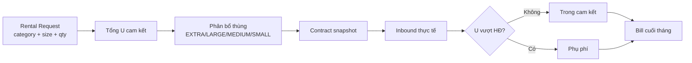

# Rental Request → Volume Units (U) → Hợp đồng → Inbound → Bill

> **Đối tượng đọc**: Toàn team (BE, FE, QA, BA).  
> **Mục đích**: Một tài liệu thống nhất luồng thuê kho theo **volume units (U)** — từ khi tenant gửi rental request đến khi xuất bill cuối tháng.  
> **Phiên bản**: 1.1 — 2026-05-31.  
> **Trạng thái**: **Policy đã chốt hướng triển khai** — một số API/DB chưa code xong (xem [Phần L — Trạng thái triển khai](#phần-l--trạng-thái-triển-khai)).

**Liên quan**: [`flow.md`](./flow.md) · [`pricing.md`](./pricing.md) · [`contract_type.md`](./contract_type.md) · [`request.md`](./request.md) · [`fe-flow-guide.md`](./fe-flow-guide.md) · code `BOX_VOLUME_UNITS` trong `src/constants/warehouseStructure.js`.

---

## Mục lục

- [Phần A — Tóm tắt 1 phút](#phần-a--tóm-tắt-1-phút)
- [Phần B — Khái niệm cốt lõi](#phần-b--khái-niệm-cốt-lõi)
- [Phần C — Catalog loại hàng & size (U)](#phần-c--catalog-loại-hàng--size-u)
- [Phần D — Luồng end-to-end](#phần-d--luồng-end-to-end)
- [Phần E — Công thức & thuật toán](#phần-e--công-thức--thuật-toán)
- [Phần F — Hợp đồng & cam kết](#phần-f--hợp-đồng--cam-kết)
- [Phần G — Inbound vượt cam kết & phụ phí](#phần-g--inbound-vượt-cam-kết--phụ-phí)
- [Phần H — Bill cuối tháng](#phần-h--bill-cuối-tháng)
- [Phần I — Ví dụ số](#phần-i--ví-dụ-số)
- [Phần J — Dữ liệu lưu trữ (đề xuất schema)](#phần-j--dữ-liệu-lưu-trữ-đề-xuất-schema)
- [Phần K — Trách nhiệm theo role](#phần-k--trách-nhiệm-theo-role)
- [Phần L — Trạng thái triển khai](#phần-l--trạng-thái-triển-khai)

---

## Phần A — Tóm tắt 1 phút

1. Tenant chọn **loại hàng theo category** (TOPS, BOTTOMS, DRESSES, OUTERWEAR) + **size** + **số lượng** trên **Rental Request**.
2. Mỗi loại hàng có **Base U** (vd. T-Shirt = 0.5U); **size** nhân **hệ số** (XS–S = 0.9, M–L = 1.0, XL–3XL = 1.2) → **Final U/cái** → tổng U cam kết (không còn “ước tính thùng”).
3. Tổng U quy đổi ra **bộ thùng/LPN chắc chắn** theo `boxType` (SMALL=1, MEDIUM=2, LARGE=4, EXTRA=8 U).
4. Ký **Hợp đồng** → snapshot U + phân bổ thùng trong thời hạn HĐ (vd. 3 tháng).
5. Trong kỳ HĐ, **Inbound** cộng dồn U thực nhận. Phần **vượt U cam kết** → **phụ phí** (thùng phát sinh + inbound/outbound/vận chuyển).
6. **Cuối mỗi tháng**: gửi bill = phí lưu trữ cam kết + toàn bộ phụ phí phát sinh trong tháng.



---

## Phần B — Khái niệm cốt lõi

### B1. Volume Unit (U)

- **U** là đơn vị quy chiếu **thể tích/chỗ chiếm** trên bin (không phải tiền).
- Dùng thống nhất từ **rental request** → **contract** → **bin capacity** → **LPN**.
- Cho phép **số thập phân** ở bước **planning** (vd. T-Shirt size S = 0.5 × 0.9 = **0.45U**). Khi nhập kho, mỗi **LPN vẫn là số nguyên U** theo `boxType` (1, 2, 4, 8).
- **Final U/cái** = **Base U** (theo loại hàng) × **Size factor** (theo nhóm size).

### B2. Quy đổi thùng (box type) — đã có trong hệ thống

| `boxType` | `volumeUnits` / 1 thùng (1 LPN) | Ghi chú |
|-----------|----------------------------------|---------|
| `SMALL`   | 1 U                              | Hàng nhỏ, phụ kiện |
| `MEDIUM`  | 2 U                              | Carton tiêu chuẩn |
| `LARGE`   | 4 U                              | Kiện lớn |
| `EXTRA`   | 8 U                              | Gần pallet |

Nguồn code: `src/constants/warehouseStructure.js` → `BOX_VOLUME_UNITS`.

**Quan hệ**: 1 EXTRA = 4 MEDIUM = 2 LARGE = 8 SMALL (về U).

### B3. Bin vật lý

- Bin shared mặc định: **16 U** tối đa (`DEFAULT_BIN_MAX_VOLUME_UNITS` trong `pricingDefaults.js`).
- Bin chặn bởi **tổng volume**, không chỉ số LPN — có thể mix nhiều loại thùng trong 1 bin nếu đủ U.

### B4. Khác với mô hình cũ

| Mô hình cũ (deprecated) | Mô hình mới |
|-------------------------|-------------|
| Nhập “tổng cái/tháng”, ~25 cái/MEDIUM | Nhập theo **loại hàng** + U/loại |
| “Ước tính ~20 thùng” | **Tính chắc chắn** N thùng từ U |
| Giữ chỗ 80% ước tính | **Cam kết 100%** U/thùng đã tính trên HĐ |
| Phát sinh khi xài trên 80% | Phát sinh khi **inbound vượt U HĐ** |

---

## Phần C — Catalog loại hàng & size (U)

Tenant chọn từ cây category (FE hiển thị dạng nhóm), khai báo **số lượng theo size** (hoặc theo nhóm size). **Base U** và **size factor** là master data — admin có thể chỉnh; bảng dưới là **draft khởi tạo**.

### C1. Cây category

```
TOPS
├── T-Shirt
├── Polo
├── Shirt
└── Blouse

BOTTOMS
├── Jeans
├── Trousers
├── Shorts
└── Skirt

DRESSES
├── Mini Dress
├── Midi Dress
└── Maxi Dress

OUTERWEAR
├── Hoodie
├── Jacket
└── Coat
```

### C2. Bảng Base U theo loại hàng (draft — cần BA/ops confirm)

Cột **Base U** là U tham chiếu size **M–L** (factor = 1.0). Size khác nhân thêm hệ số ở [C3](#c3-hệ-số-size-size-factor).

| Nhóm | Loại hàng | Code | Base U |
|------|-----------|------|--------|
| TOPS | T-Shirt | `T_SHIRT` | **0.5** |
| TOPS | Polo | `POLO` | 0.5 |
| TOPS | Shirt | `SHIRT` | 0.75 |
| TOPS | Blouse | `BLOUSE` | 0.75 |
| BOTTOMS | Jeans | `JEANS` | **1.0** |
| BOTTOMS | Trousers | `TROUSERS` | 1.0 |
| BOTTOMS | Shorts | `SHORTS` | 0.75 |
| BOTTOMS | Skirt | `SKIRT` | 0.75 |
| DRESSES | Mini Dress | `MINI_DRESS` | 1.0 |
| DRESSES | Midi Dress | `MIDI_DRESS` | 1.25 |
| DRESSES | Maxi Dress | `MAXI_DRESS` | 1.5 |
| OUTERWEAR | Hoodie | `HOODIE` | 1.5 |
| OUTERWEAR | Jacket | `JACKET` | 2.0 |
| OUTERWEAR | Coat | `COAT` | 3.0 |

> **Lưu ý vận hành**: Base U phản ánh **độ chiếm chỗ khi đóng thùng** (size M–L), không phải trọng lượng. Kho có thể điều chỉnh catalog sau khi có số liệu thực tế.

### C3. Hệ số size (Size factor)

**Công thức:**

```
Final U / 1 cái = Base U × Size factor
```

**Bảng nhóm size (áp dụng chung mọi loại hàng có size):**

| Size group | Size cụ thể (ví dụ) | Factor |
|------------|---------------------|--------|
| **XS–S** | XS, S | **0.9** |
| **M–L** | M, L | **1.0** |
| **XL–3XL** | XL, XXL, 2XL, 3XL | **1.2** |

**Ví dụ T-Shirt (Base U = 0.5):**

| Size | Tính | Final U / cái |
|------|------|----------------|
| S | 0.5 × 0.9 | **0.45 U** |
| M | 0.5 × 1.0 | **0.50 U** |
| 3XL | 0.5 × 1.2 | **0.60 U** |

**Ví dụ Jeans (Base U = 1.0):**

| Size | Tính | Final U / cái |
|------|------|----------------|
| S | 1.0 × 0.9 | **0.90 U** |
| L | 1.0 × 1.0 | **1.00 U** |
| XL | 1.0 × 1.2 | **1.20 U** |

**Trên form Rental Request**, mỗi dòng nên cho tenant nhập:

- `productKind` + `size` (hoặc chọn sẵn `sizeGroup`) + `quantity`
- FE tự tính `finalVolumeUnitsPerPiece` và `lineVolumeUnits`

**One-size / không có size** (vd. phụ kiện, một số outerwear free size): dùng factor **1.0** (coi như M–L).

---

## Phần D — Luồng end-to-end

### D1. Guest / Tenant tạo Rental Request

**Actor**: Guest (landing) hoặc `TENANT_ADMIN`.

**Input mỗi dòng**:

| Field | Mô tả |
|-------|--------|
| `productKind` | Code loại hàng (vd. `T_SHIRT`) |
| `size` hoặc `sizeGroup` | Size cụ thể (S, M, 3XL…) hoặc nhóm (`XS_S`, `M_L`, `XL_3XL`) |
| `quantity` | Số lượng cam kết trong **kỳ thuê** (vd. 100 cái / 3 tháng) |
| `baseVolumeUnitsPerPiece` | Base U từ catalog (read-only) |
| `sizeFactor` | Hệ số size (0.9 / 1.0 / 1.2 — read-only sau khi chọn size) |
| `finalVolumeUnitsPerPiece` | `baseU × sizeFactor` (auto) |

**Output tự tính (FE + validate BE)**:

- `totalCommittedVolumeUnits`
- `boxAllocation[]` — danh sách `{ boxType, count }`
- `contractPeriod` — ngày bắt đầu / kết thúc dự kiến

**UI gợi ý hiển thị**:

```
60 × T-Shirt size S  (0.5 × 0.9 = 0.45 U) = 27 U
40 × T-Shirt size M  (0.5 × 1.0 = 0.50 U) = 20 U
─────────────────────────────────────────────
Tổng: 47 U → 5 EXTRA + 1 LARGE + 1 MEDIUM + 1 SMALL
Cam kết trên HĐ: 47 U / 8 thùng
```

### D2. WH_ADMIN / SYSTEM_ADMIN review

- Xem breakdown U + thùng.
- Đàm phán giá (`contract_items`: STORAGE `BOX_DAY`, INBOUND `INBOUND_LPN`, …).
- Approve → tạo tenant (nếu mới) + contract.

### D3. Ký hợp đồng

- Snapshot **toàn bộ** cam kết từ rental request lên contract (không recalculate sau khi ký).
- Gán **storage reservation** theo U/thùng đã cam kết.
- Status: `rental_requests` → `CONVERTED`.

### D4. Vận hành trong kỳ HĐ

- Tenant tạo **Inbound Request** (gắn loại hàng + **size** + qty).
- WH receive → LPN → putaway (volume trên LPN theo `boxType`).
- Hệ thống **cộng dồn U đã nhận** so với **U cam kết HĐ**.

### D5. Bill cuối tháng

- Job billing tổng hợp dòng phí → gửi tenant (`TENANT_ADMIN` xem / export).

---

## Phần E — Công thức & thuật toán

### E1. Tổng U cam kết

**Theo từng dòng (có size):**

```
finalU[i] = baseU[i] × sizeFactor[i]
lineU[i]  = quantity[i] × finalU[i]
```

**Tổng:**

```
totalU = Σ lineU[i]
```

**Ví dụ nhanh:**

- 100 × T-Shirt size M: `100 × (0.5 × 1.0) = 50 U`
- 100 × T-Shirt size S: `100 × (0.5 × 0.9) = 45 U`
- 100 × T-Shirt size 3XL: `100 × (0.5 × 1.2) = 60 U`

### E2. Phân bổ thùng (greedy — ưu tiên thùng lớn)

**Thứ tự ưu tiên**: `EXTRA (8)` → `LARGE (4)` → `MEDIUM (2)` → `SMALL (1)`.

```
remaining = totalU
for boxType in [EXTRA, LARGE, MEDIUM, SMALL]:
  count = floor(remaining / BOX_VOLUME_UNITS[boxType])
  if count > 0:
    allocation[boxType] = count
    remaining -= count × BOX_VOLUME_UNITS[boxType]
if remaining > 0:
  // Phần dư < 1 SMALL — làm tròn lên 1 thùng nhỏ nhất chứa được
  pick smallest boxType where BOX_VOLUME_UNITS[boxType] >= remaining
  allocation[boxType] += 1
```

**Ví dụ 50 U**:

| Bước | Kết quả |
|------|---------|
| EXTRA | floor(50/8) = **6**, dư 2 U |
| MEDIUM | floor(2/2) = **1**, dư 0 U |
| **Tổng** | **6 EXTRA + 1 MEDIUM = 50 U** |

> Không hiển thị “6.25 thùng EXTRA” — luôn ra **số nguyên từng loại thùng**.

### E3. Pseudocode TypeScript (tham khảo implement)

```typescript
const BOX_ORDER = ['EXTRA', 'LARGE', 'MEDIUM', 'SMALL'] as const
const BOX_U = { SMALL: 1, MEDIUM: 2, LARGE: 4, EXTRA: 8 }

function allocateBoxes(totalU: number): Record<string, number> {
  let remaining = totalU
  const out: Record<string, number> = {}
  for (const bt of BOX_ORDER) {
    const u = BOX_U[bt]
    const n = Math.floor(remaining / u)
    if (n > 0) { out[bt] = n; remaining -= n * u }
  }
  if (remaining > 0) {
    const pick = BOX_ORDER.find((bt) => BOX_U[bt] >= remaining) ?? 'SMALL'
    out[pick] = (out[pick] ?? 0) + 1
  }
  return out
}
```

---

## Phần F — Hợp đồng & cam kết

### F1. Snapshot trên contract (bắt buộc lưu)

Khi HĐ ACTIVE, lưu **bất biến** (hoặc versioned):

```json
{
  "committedProductLines": [
    {
      "productKind": "T_SHIRT",
      "size": "S",
      "sizeGroup": "XS_S",
      "quantity": 60,
      "baseVolumeUnitsPerPiece": 0.5,
      "sizeFactor": 0.9,
      "finalVolumeUnitsPerPiece": 0.45,
      "lineVolumeUnits": 27
    },
    {
      "productKind": "T_SHIRT",
      "size": "M",
      "sizeGroup": "M_L",
      "quantity": 40,
      "baseVolumeUnitsPerPiece": 0.5,
      "sizeFactor": 1.0,
      "finalVolumeUnitsPerPiece": 0.5,
      "lineVolumeUnits": 20
    }
  ],
  "totalCommittedVolumeUnits": 47,
  "boxAllocation": [
    { "boxType": "EXTRA", "count": 5 },
    { "boxType": "LARGE", "count": 1 },
    { "boxType": "MEDIUM", "count": 1 },
    { "boxType": "SMALL", "count": 1 }
  ],
  "contractStartDate": "2026-06-01",
  "contractEndDate": "2026-08-31"
}
```

### F2. Phí lưu trữ cam kết

- Tính từ `boxAllocation` × **đơn giá BOX_DAY** theo `boxType` trên `contract_items`.
- Tham chiếu giá mặc định: `STORAGE_BOX_DAY_PRICE_BY_BOX_TYPE` (`pricingDefaults.js` / `docs/pricing.md`).

### F3. Dưới cam kết (under-utilization)

- Tenant nhập kho **ít hơn** U đã cam kết vẫn trả **phí lưu trữ theo HĐ** (đã giữ chỗ bin/reservation).
- Ghi rõ trên UI rental + điều khoản HĐ.

---

## Phần G — Inbound vượt cam kết & phụ phí

### G1. Nguyên tắc

- **U cam kết** = từ rental/HĐ (vd. 50 U).
- **U thực nhận** = tổng U tính từ inbound đã receive/store trong **kỳ HĐ** (theo loại hàng + **size** × Base U × size factor tại thời điểm inbound, hoặc snapshot trên HĐ).
- **U phát sinh (overage)**:

```
overageU = max(0, receivedU_cumulative - committedU)
```

### G2. Ví dụ overage

| | U |
|--|---|
| HĐ: 100 T-Shirt × 0.5 U | **50 U cam kết** |
| Inbound thêm: 50 × Jeans (1 U) | **+50 U** |
| Tổng đã nhận | 100 U |
| **Overage** | **50 U** |

50 U overage → phân bổ thùng (vd. 6 EXTRA + 1 MEDIUM) → tính **phụ phí lưu trữ** (box-day) cho phần overage.

### G3. Phụ phí gồm những gì

| Loại | Khi nào | Đơn vị billing |
|------|---------|----------------|
| **Thùng phát sinh** | U vượt HĐ → thêm LPN/bin | `BOX_DAY` theo `boxType` |
| **Inbound fee** | Mỗi LPN nhập (đặc biệt LPN thuộc overage) | `INBOUND_LPN` |
| **Outbound fee** | Mỗi lần xuất / handling | `HANDLING_UNIT` hoặc rule riêng |
| **Vận chuyển** | Có dịch vụ transport | Theo bảng giá / manual line |

> **Chốt rule**: Overage U tính **cộng dồn theo kỳ HĐ**; bill **phân bổ theo tháng** phần phát sinh **trong tháng đó** (inbound date / storage days).

### G4. Inbound trong cam kết

- Inbound nằm trong `committedU` → chỉ tính **inbound LPN fee** (theo contract item), **không** tính thêm phụ phí thùng (đã nằm trong phí lưu trữ cam kết).

---

## Phần H — Bill cuối tháng

### H1. Công thức tổng

```
Bill tháng =
  Phí lưu trữ cam kết (prorated nếu tháng đầu/cuối HĐ)
+ Phụ phí thùng phát sinh (BOX_DAY × overage boxes × days)
+ Inbound fee (LPN trong tháng, tách line cam kết vs overage nếu cần)
+ Outbound fee
+ Vận chuyển
+ Thuế / điều chỉnh thủ công (nếu có)
```

### H2. Cấu trúc bill (gợi ý UI)

| # | Mô tả | Số lượng | Đơn giá | Thành tiền |
|---|--------|----------|---------|------------|
| 1 | STORAGE cam kết — EXTRA × 6 | 6 × 30 ngày | 50,000/ngày | … |
| 2 | STORAGE cam kết — MEDIUM × 1 | 1 × 30 ngày | 20,000/ngày | … |
| 3 | **Phụ phí** STORAGE overage — EXTRA × 6 | … | … | … |
| 4 | INBOUND LPN (trong cam kết) | 7 LPN | 20,000/LPN | … |
| 5 | INBOUND LPN (overage) | 7 LPN | 20,000/LPN | … |
| 6 | OUTBOUND handling | … | … | … |
| 7 | Vận chuyển | 1 chuyến | … | … |

### H3. Chu kỳ

- **Cuối mỗi tháng** (calendar month) generate & gửi.
- Tenant xem trên portal; WH_ADMIN / SYSTEM_ADMIN audit.

---

## Phần I — Ví dụ số

### I1. Rental request — T-Shirt đơn size (M)

**Input**: 100 T-Shirt size M, kỳ HĐ 3 tháng.

| Bước | Giá trị |
|------|---------|
| Final U/cái | 0.5 × 1.0 = **0.5 U** |
| U dòng | 100 × 0.5 = **50 U** |
| Phân bổ | **6 EXTRA + 1 MEDIUM** |
| Cam kết HĐ | 50 U, 7 thùng |

### I1b. Rental request — T-Shirt mix size

**Input**:

| Loại | Size | SL | Final U/cái | U dòng |
|------|------|-----|-------------|--------|
| T-Shirt | S | 60 | 0.5 × 0.9 = 0.45 | 27 |
| T-Shirt | M | 40 | 0.5 × 1.0 = 0.50 | 20 |
| **Tổng** | | 100 | | **47 U** |

Phân bổ (greedy): **5 EXTRA + 1 LARGE + 1 MEDIUM + 1 SMALL** (= 40 + 4 + 2 + 1 = **47 U**).

### I2. Mix nhiều loại trên 1 rental request

| Loại | Size | SL | U/cái | U dòng |
|------|------|-----|-------|--------|
| T-Shirt | M | 200 | 0.5 | 100 |
| Jeans | L | 100 | 1.0 | 100 |
| **Tổng** | | | | **200 U** |

Phân bổ: floor(200/8)=**25 EXTRA** (200 U) — không dư.

### I3. Overage trong tháng 2

- HĐ: 50 U (6 EXTRA + 1 MEDIUM).
- Tháng 1: inbound 50 U → trong cam kết.
- Tháng 2: inbound thêm 50 U (50 Jeans) → **50 U overage**.
- Bill tháng 2 += phụ phí thùng + inbound fee phần overage.

---

## Phần J — Dữ liệu lưu trữ (đề xuất schema)

### J1. Bảng / field mới (draft)

**`product_kind_catalog`** (master data)

| Column | Type |
|--------|------|
| `product_kind` | varchar PK |
| `category` | enum TOPS/BOTTOMS/DRESSES/OUTERWEAR |
| `display_name` | varchar |
| `base_volume_units_per_piece` | decimal (Base U, size M–L) |
| `has_size` | boolean |
| `status` | ACTIVE/INACTIVE |

**`size_factor_catalog`** (master data — có thể global)

| Column | Type |
|--------|------|
| `size_group` | enum `XS_S`, `M_L`, `XL_3XL` PK |
| `display_label` | varchar (vd. "XS–S") |
| `factor` | decimal (0.9 / 1.0 / 1.2) |
| `sizes` | jsonb (vd. `["XS","S"]`) |

**`rental_request_product_lines`**

| Column | Type |
|--------|------|
| `line_id` | uuid PK |
| `rental_request_id` | uuid FK |
| `product_kind` | varchar FK |
| `size` | varchar nullable (S, M, 3XL…) |
| `size_group` | enum nullable |
| `quantity` | int |
| `base_volume_units_per_piece` | decimal (snapshot) |
| `size_factor` | decimal (snapshot) |
| `final_volume_units_per_piece` | decimal (snapshot) |
| `line_volume_units` | decimal |

**`rental_requests`** (bổ sung)

| Column | Type |
|--------|------|
| `total_committed_volume_units` | decimal |
| `box_allocation_json` | jsonb |
| `selected_box_type_hint` | varchar optional — nếu UI chỉ show 1 phương án |

**`contracts`** (bổ sung snapshot JSON hoặc bảng con)

| Column | Type |
|--------|------|
| `committed_snapshot_json` | jsonb |

**`contract_usage_ledger`** (tracking overage)

| Column | Type |
|--------|------|
| `contract_id` | uuid |
| `period_month` | date |
| `committed_u` | decimal |
| `received_u_cumulative` | decimal |
| `overage_u_in_month` | decimal |
| `overage_box_allocation_json` | jsonb |

### J2. API gợi ý

| Method | Path | Mô tả |
|--------|------|--------|
| GET | `/api/product-kinds` | Catalog category + Base U |
| GET | `/api/size-factors` | Bảng hệ số size (XS–S / M–L / XL–3XL) |
| POST | `/api/rental-requests` | Body có `productLines[]` |
| GET | `/api/contracts/:id/usage` | U cam kết vs đã nhận vs overage |
| GET | `/api/billing/invoices?month=` | Bill đã generate |

---

## Phần K — Trách nhiệm theo role

| Role | Việc liên quan flow U |
|------|------------------------|
| **Guest / TENANT_ADMIN** | Chọn loại hàng + **size** + SL trên rental request; inbound khai báo đúng size |
| **WH_ADMIN** | Review U/thùng; ký HĐ; duyệt inbound; xử lý overage |
| **WH_STAFF** | Receive LPN đúng box type; putaway theo volume bin |
| **SYSTEM_ADMIN** | Chỉnh catalog U; giá contract_items; cấu hình billing job |
| **BE** | Catalog, tính U, snapshot HĐ, ledger overage, billing |
| **FE** | Form category lines, hiển thị phân bổ thùng, usage vs HĐ trên inbound |
| **QA** | Test case E1–E3, overage I3, under-utilization F3 |

---

## Phần L — Trạng thái triển khai

| Thành phần | Trạng thái | Ghi chú |
|------------|------------|---------|
| `BOX_VOLUME_UNITS` (BE) | ✅ Có | `warehouseStructure.js` |
| Bin capacity theo U | ✅ Có | putaway, `BinModal`, inbound |
| LPN `volumeUnits` | ✅ Có | `lpn.service.js` |
| Rental form “cái/tháng” cũ | ⚠️ Legacy | `RentalRequestForm.tsx`, `rentalBoxEstimate.ts` |
| Catalog product kind + Base U | ❌ Chưa | Cần master data + API |
| Catalog size factor | ❌ Chưa | XS–S / M–L / XL–3XL |
| Rental request `productLines` | ❌ Chưa | BE + FE |
| Contract committed snapshot | ❌ Chưa | JSON hoặc bảng con |
| Overage ledger + billing job | ❌ Chưa | Flow 8 billing |
| Bill line breakdown | ❌ Chưa | Invoice module |

**Thứ tự implement đề xuất**:

1. Catalog + util `allocateBoxes()` (FE/BE shared logic).
2. Rental request API + form category.
3. Contract snapshot khi convert rental → contract.
4. Inbound gắn `productKind` + cộng dồn U vs HĐ.
5. Monthly billing + invoice UI.

---

## FAQ nhanh

**Hỏi: 0.45 U (T-Shirt size S) có nghĩa là gì?**  
Đáp: **Final U/cái** sau khi nhân size factor (0.5 × 0.9). Ở bước planning cộng nhiều cái được số thập phân. Lúc nhập kho vẫn đóng **nguyên LPN** (1, 2, 4, 8 U).

**Hỏi: Size 3XL tính thế nào?**  
Đáp: Thuộc nhóm **XL–3XL**, factor **1.2**. T-Shirt: `0.5 × 1.2 = 0.6 U/cái`.

**Hỏi: Hàng không có size (one-size)?**  
Đáp: Dùng factor **1.0** (coi như M–L), chỉ nhập `productKind` + `quantity`.

**Hỏi: Tenant đổi catalog U sau khi ký HĐ?**  
Đáp: HĐ giữ **snapshot Base U + size factor + final U** lúc ký. Catalog mới chỉ áp inbound/HĐ mới.

**Hỏi: Có cho tenant chọn chỉ MEDIUM thay vì mix EXTRA+SMALL?**  
Đáp: Có thể thêm **chế độ “single box type”** (`ceil(totalU / volBox)`) trên UI — cần chốt với ops. Mặc định doc này dùng **greedy multi-type** (tối ưu chỗ).

**Hỏi: Profile cá nhân tenant có ảnh hưởng HĐ không?**  
Đáp: Không. HĐ dùng **tenant company** + **committed snapshot U**, không dùng `users.fullName`.

---

*Tài liệu này là source of truth cho policy rental theo U. Khi implement xong từng phần, cập nhật [Phần L](#phần-l--trạng-thái-triển-khai) và link PR.*
